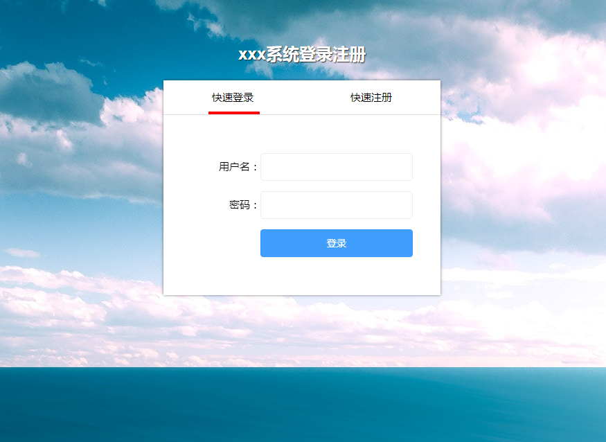
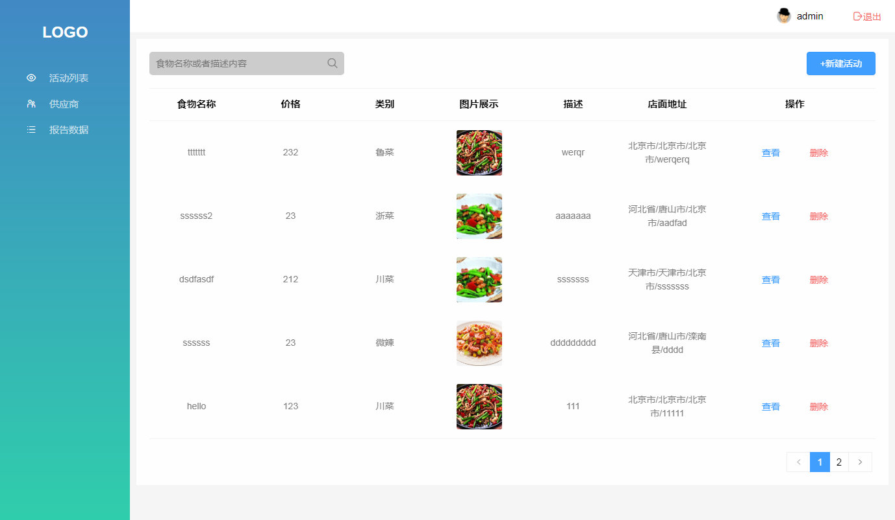

# login
session的应用案例

#### 介绍

> 使用session方式保存用户登录的信息，做的小项目,有登录、登出、添加等功能，前端利用了vue.js框架，后端用了nodejs的语言编写的数据接口，数据库使用的mongodb
>
> **部分截图**
>
> + 登录
>
> 
>
> + 列表页
>
>   

#### 项目结构

~~~javascript
login:.
│  .gitignore
│  README.md
│  
├─client                  		//前端代码部分
│  │  babel.config.js
│  │  package-lock.json
│  │  package.json
│  │  README.md
│  │  vue.config.js				//vue基本配置
│  │                
│  ├─public
│  │      favicon.ico
│  │      index.html
│  │      
│  └─src
│      │  App.vue
│      │  main.js				//入口文件
│      │  router.js				//前端页面跳转路由
│      │  
│      ├─assets					//静态资源
│      │  ├─css
│      │  │      iconfont.css
│      │  │      var.js			//使用的css样式，页面的主题色 heyUI
│      │  │      
│      │  └─img
│      │          avatar.jpeg
│      │          bg.jpg
│      │          logo.png
│      │          
│      ├─components				//组件
│      │  ├─aside
│      │  │      Aside.vue
│      │  │      
│      │  └─header
│      │          Header.vue
│      │          
│      └─pages					//页面资源
│          ├─404
│          │      NotExist.vue
│          │      
│          ├─agency
│          │      Agency.vue
│          │      
│          ├─home
│          │      AddFood.vue
│          │      EditFood.vue
│          │      index.vue
│          │      
│          ├─login
│          │      Login.vue
│          │      
│          └─report
│                  ReportData.vue
│                  
└─server						//后端数据接口部分
    │  index.js
    │  package-lock.json
    │  package.json
    │  
    ├─api						//restful设计模式的接口地址
    │  ├─categroy				//食品分类
    │  │      categroy.js
    │  │      
    │  ├─city					//省市区的地址
    │  │      city.js
    │  │      
    │  ├─food					//食物信息接口
    │  │      food.js
    │  │      
    │  └─user					//用户接口
    │          user.js
    │          
    ├─config					//配置信息：数据库地址、名称、session建立时的加密字符串
    │      config.js
    │      
    ├─db						//初始化数据库的链接和反馈信息
    │      db.js
    │      
    ├─models					//数据模型
    │  ├─categroy
    │  │      categroy.js
    │  │      
    │  ├─city
    │  │      city.js
    │  │      
    │  ├─foods
    │  │      foods.js
    │  │      
    │  └─users
    │          users.js
    │          
    ├─public					//公共资源
    │  └─img
    │          avatar_default.png
    │          default_food.png
    │          
    ├─upload					//上传图片资源的保存地址
    │      
    │      
    └─utils						//工具库
            city.json			//所有的城市数据
            

~~~

#### 运行方式

~~~javascript	
前端client
// 安装依赖 cd/client
npm install

//在本地服务器上的8080端口启动热加载调试
npm run serve

//以最小化构建产品
npm run build

后台server
// 安装依赖 cd/server
npm install
//在本地服务器上的9000端口启动热加载调试
nodemon index.js

~~~

